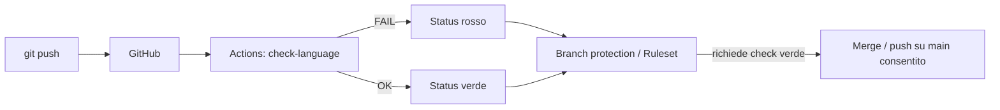

# check_language

Tool di verifica per le tabelle messaggi firmware Rhea/laRhea:

| File | Ruolo |
|------|--------|
| [`LANG_DEF.h`](LANG_DEF.h) | Macro `MAX_*` (conteggi e larghezze attese) |
| [`MES_LARHEA_GB.c`](MES_LARHEA_GB.c) | Testi inglesi (`GB_*`) |
| [`MES_LARHEA_ML.c`](MES_LARHEA_ML.c) | ID multilingua (`ML_*`, es. `@A001`) |

Lo script [`tools/check_language_arrays.py`](tools/check_language_arrays.py) controlla:

1. **Dimensionamento** di ogni array rispetto a `LANG_DEF.h`
   - numero elementi (da commenti indice `/* MSA n. N */` / `/* 01 */`)
   - lunghezza in byte di ogni stringa rispetto alla larghezza dichiarata (`[N][W]`)
2. **Allineamento GB ↔ ML**
   - stesse tabelle / dimensioni
   - stessa struttura di macro condizionali (`#ifdef` / `#if defined` normalizzati)
   - uso di letterali al posto delle macro (es. `[13]` invece di `MAX_NOME_PRESEL`)

Nessuna dipendenza pip: serve solo **Python 3.10+**.

---

## Uso locale

Dalla root del repository:

```bash
python tools/check_language_arrays.py
```

Exit code `0` = OK, `1` = errori (il push/CI deve fallire).

Opzioni utili:

```bash
python tools/check_language_arrays.py --warnings-as-errors
python tools/check_language_arrays.py --root .
```

### Hook pre-push (opzionale, solo sulla tua macchina)

```bash
cp tools/pre-push.sample .git/hooks/pre-push
# Git Bash / Linux / macOS:
chmod +x .git/hooks/pre-push
```

Su Windows con PowerShell, se `python` non è nel PATH del hook, usa il percorso completo a `python.exe` dentro lo script.

---

## Come attivare i check su GitHub (passo passo)

GitHub **non esegue** script sul server al momento del `git push` se non configuri CI + regole sul branch. Il flusso consigliato è:



### Passo 1 — Commit e push del tool

Assicurati che nel repo ci siano:

- `tools/check_language_arrays.py`
- `.github/workflows/check-language.yml`
- i tre file sorgente (`LANG_DEF.h`, `MES_LARHEA_GB.c`, `MES_LARHEA_ML.c`)

```bash
git add LANG_DEF.h MES_LARHEA_GB.c MES_LARHEA_ML.c tools .github README.md
git commit -m "Add language array size/alignment checker and GitHub Actions"
git push -u origin main
```

> Se il check fallisce già sui file attuali (errori noti sotto), il job Actions sarà rosso: è il comportamento voluto. Correggi i file oppure, in fase di bootstrap, fai il primo push prima di attivare la branch protection.

### Passo 2 — Verifica che Actions parta

1. Apri il repo su GitHub → scheda **Actions**
2. Dovresti vedere il workflow **check-language**
3. Apri l’ultima run e controlla il log di `Run language array checker`

Se Actions non parte: **Settings → Actions → General** → abilita “Allow all actions”.

### Passo 3 — Impedire merge/push su `main` se il check è rosso

Due modi equivalenti (ne basta uno).

#### Opzione A — Branch protection (classica)

1. **Settings → Branches → Add branch protection rule**
2. Branch name pattern: `main` (o `master`)
3. Abilita:
   - **Require a pull request before merging** (consigliato)
   - **Require status checks to pass before merging**
4. In “Status checks”, cerca e seleziona:
   - `Check MES_LARHEA array sizes & alignment`
   (compare dopo la prima run del workflow)
5. Salva.

Effetto: non si può fare merge su `main` finché il checker non è verde. I push diretti a `main` vanno disabilitati dalla stessa regola (“Do not allow bypassing…” / require PR).

#### Opzione B — Rulesets (più moderna)

1. **Settings → Rules → Rulesets → New branch ruleset**
2. Target: `main`
3. Enforce: **Active**
4. Rules:
   - Require a pull request before merging
   - Require status checks to pass → aggiungi il check del workflow sopra
5. Salva.

### Passo 4 — Flusso di lavoro quotidiano

1. Modifica `MES_LARHEA_GB.c` / `MES_LARHEA_ML.c` / `LANG_DEF.h`
2. In locale: `python tools/check_language_arrays.py`
3. `git push` su un branch feature
4. Apri una **Pull Request** verso `main`
5. Attendi Actions verde → merge

---

## Migrazione successiva a GitLab

Lo stesso script è riusabile senza modifiche. Su GitLab crea `.gitlab-ci.yml`:

```yaml
check-language:
  image: python:3.12-alpine
  script:
    - python tools/check_language_arrays.py
  rules:
    - if: $CI_PIPELINE_SOURCE == "merge_request_event"
    - if: $CI_COMMIT_BRANCH == $CI_DEFAULT_BRANCH
```

Poi in **Settings → Merge requests** abilita “Pipelines must succeed”.

---

## Errori noti sullo stato attuale dei file

Il checker, sui file presenti ora nel repo, segnala tra l’altro:

| Problema | Dove |
|----------|------|
| `MAX_NOME_PRESEL=15` ma solo 14 / 13 elementi | `GB_MS_NOME_PRESEL_1`, `ML_MS_NOME_PRESEL_1` |
| ML usa letterale `[13]` invece di `MAX_NOME_PRESEL` | `MES_LARHEA_ML.c` |
| `MAX_MSG_SLAVE=30` ma solo 12 elementi | `GB_MS_MODULI_EST` / `ML_MS_MODULI_EST` |
| Stringhe lunghe 31 invece di 32 | `ML_MSA_1` (`@A237`, `@A238`) |
| Stringa lunga 30 invece di 32 | `ML_MS_MODULI_EST` (`@Z002…`) |

Sono **diff reali** nei sorgenti: finché non li correggi, CI resta rossa (e con branch protection non si mergea).

---

## Cosa non fa (di proposito)

- Non compila il firmware (mancano `config.h` / `rhea_mapping.h` e le define di prodotto).
- Non valuta un solo set di `#define` cliente: confronta la **struttura** dei branch e gli indici documentati.
- Non traduce / non valida il significato degli ID `@A001` rispetto all’Excel multilingua.
